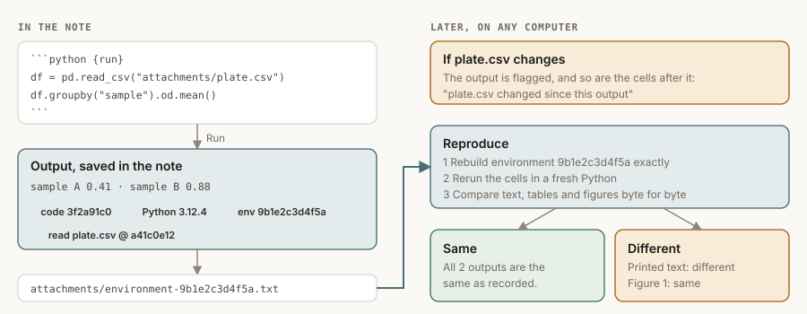
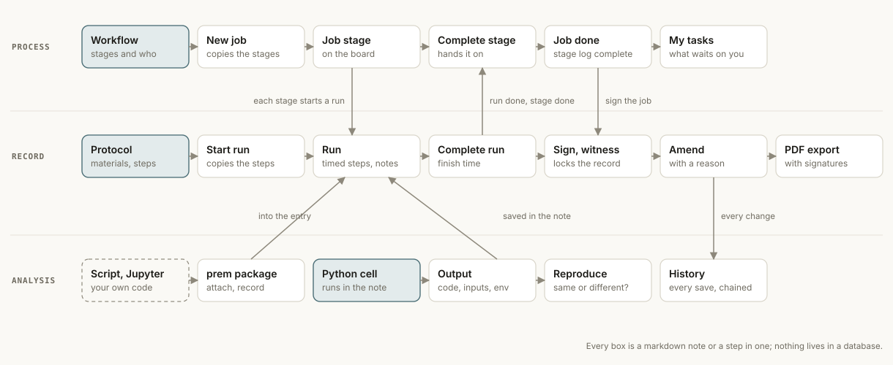
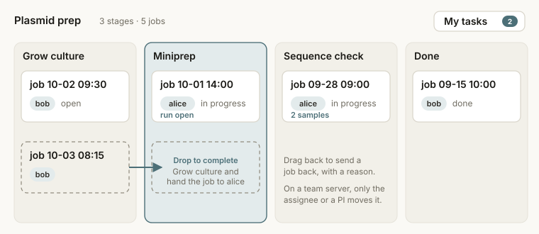
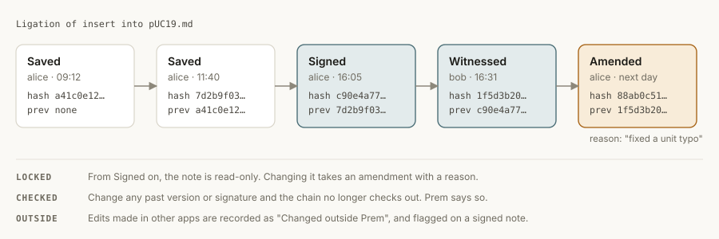

<p align="center"></p>

# Prem

**An open-source lab notebook that runs on your own machines.**

Prem is a desktop app for research labs. Each person keeps a daily notebook; the lab shares protocols; running a protocol records every step with a timestamp; samples, experiments and runs link to each other; and finished records are signed, witnessed and locked. Everything is a plain markdown file in a folder you own, with every version kept and a tamper-evident history, so your records stay readable for decades and never depend on a vendor.

Prem is in active development towards a first release. It is being piloted with research labs now; see the [roadmap](#roadmap).

**Website:** [cameronjtoy.github.io/Prem](https://cameronjtoy.github.io/Prem/)


## Why Prem

- **Your data stays with the lab.** Notebooks are folders of markdown and attachments on your computer or on a server you run. No account with us, no cloud, no telemetry.
- **Built for the bench.** Protocols with checkable steps, runs that record when each step was done and what deviated, samples with IDs and storage locations, and attachments for gels, plates and traces.
- **Records you can stand behind.** Every save is kept. Signing locks an entry; a colleague witnesses it; later changes are amendments with a reason. Any tampering with the history is detectable.
- **Works for one person or a whole lab.** Start with a local folder. Add the team server when you want shared protocols, per-person notebooks and permissions (students write their own notebook, the PI reads everything).
- **Open source** under Apache-2.0, with a codebase meant to be read and extended.

## Getting started

Download Prem for macOS, Windows or Linux from the [latest release](https://github.com/cameronjtoy/Prem/releases/latest). The installers aren't signed yet, so macOS and Windows warn the first time you open Prem; the [install guide](docs/install.md) shows how to get past that.

To run from source instead:

```bash
git clone https://github.com/cameronjtoy/Prem.git
cd Prem
npm install
npm run dev
```

Choose **Open a folder as a vault** and pick [`examples/sample-vault/`](examples/sample-vault) to explore a small lab notebook with a protocol, a workflow with a job in progress, a completed run, an experiment with a gel image, and samples. Start with its `Welcome` note.

### Keyboard shortcuts

Press ⌘⇧P for the command palette, which lists every command, or ⌘/ for this list inside Prem.

<!-- shortcuts:start -->
| Shortcut (Ctrl on Windows and Linux) | Action |
|---|---|
| ⇧⌘P | Command palette |
| ⌘/ | Keyboard shortcuts |
| ⌘, | Settings |
| ⌘K | Search all notes |
| ⌘E | Go to note… |
| ⌘[ | Back |
| ⌘] | Forward |
| ⌘T | Today's entry |
| ⌘N | New note |
| ⇧⌘N | New note from template |
| ⌘O | Open another vault |
| ⌘P | Export as PDF |
| ⌘S | Save now |
| ⇧⌘H | History of this note |
| ⇧⌘E | Show in file list |
| ⇧⌘A | Attach a file… |
| ⇧⌘T | Insert date and time |
| ⇧⌘S | Sign this record… |
| ⇧⌘R | Start a run of this protocol |
| ⇧⌘D | Add a deviation |
| ⇧↵ | Run Python cell |
| ⌥⌘↵ | Run all Python cells |
| ⌘↵ | Tick or untick step |
| ⌘B | Bold |
| ⌘I | Italic |
| ⇧⌘X | Strikethrough |
| ⌘L | Insert link to a note |
| ⌥⌘1 | Heading 1 |
| ⌥⌘2 | Heading 2 |
| ⌥⌘3 | Heading 3 |
| ⌘G | Graph of links |
| ⌘\\ | Show or hide the file list |
| ⇧⌘\\ | Show or hide links |
<!-- shortcuts:end -->

### Settings

Open **Settings** with ⌘, (Ctrl+, on Windows and Linux): theme, text size and line width; spelling, line numbers, how soon notes save and the inserted date format; where your notebook goes and whether to confirm before trashing; and the PDF page size.

Everything on that screen is also in `settings.json`, which lists only what you've changed, so it's easy to read, copy to another computer or keep in a dotfiles repo:

```json
{
  "appearance.theme": "dark",
  "appearance.textSize": 18,
  "notebook.folder": "Lab notebook"
}
```

**Open settings.json** on the Settings screen opens it in your editor. It lives in Prem's settings folder (`~/Library/Application Support/Prem` on macOS, `%APPDATA%\Prem` on Windows, `~/.config/Prem` on Linux), and changes apply as soon as you save. If the file has a mistake, Prem says where and keeps using your last good settings.

### Python analysis in notes



Put code in a `python {run}` block and choose **Run** (or ⇧↵). The output (text, tables, figures) is saved in the note under the cell, along with what produced it: the code, who ran it, the Python environment, and a checksum of every file it read. Add an `environment.txt` to the vault so every computer in the lab uses the same packages. Prem saves the exact package list with each output, flags outputs whose input files changed, and **↻ Reproduce** reruns a note in the recorded environment and reports what still matches. See [`docs/analysis.md`](docs/analysis.md).

From your own scripts and Jupyter notebooks, the [`prem-notebook`](python) package writes to an entry directly: `entry.attach(fig)`, `entry.record("Colonies", 84)`, `entry.tables()`. It works with a vault folder or a team server, and never changes signed notes. See [`docs/python.md`](docs/python.md).

### Changing shortcuts

Settings → **Keyboard shortcuts** lists every command. Choose **Change** and press the new keys; if another command already uses them, Prem asks whether to move the shortcut or let both share it (whichever can run at the time does). **Remove** and **Reset** undo a change.

Your changes are saved in `keybindings.json`, next to `settings.json`. Write `Mod` for ⌘ on macOS and Ctrl elsewhere, and put `-` before a command to take its shortcut away:

```json
[
  { "key": "Mod+Shift+L", "command": "format.link" },
  { "command": "-note.today" }
]
```

The command ids are listed on the Keyboard shortcuts tab. Like settings, the file applies as soon as you save it, menus included.

## Features



**Notebook**
- **Daily entries** (⌘T) filed by year: `Notebook/2026/2026-09-30.md`, or `Notebooks/<name>/…` on a shared vault so each person's notebook can have its own permissions.
- **Templates** for Experiment, Protocol, Sample, Lab meeting, Reference and Daily entry, with `{{title}}`, `{{date}}`, `{{time}}`, `{{author}}` and `{{cursor}}` placeholders. Add your own to the vault's `templates/` folder.
- **Live-preview editor** (CodeMirror): markdown syntax hides except on the line you're editing. Equations with KaTeX, tables, checkboxes, syntax-highlighted code.
- **Links** between notes with `[[Note]]`, autocomplete, backlinks and a graph view. A link to a note that doesn't exist yet creates it on click. Renaming or moving a note, attachment or folder updates the links to it everywhere; signed notes are left as signed, and Prem tells you which still use the old name.
- **Attachments**: drop files or paste screenshots into an entry. Images and CSV/TSV preview inline, and **Jupyter notebooks (.ipynb)** show their markdown, code and saved outputs (tables, plots, errors) read-only, with nothing run; other files open in their default app (only known data formats are opened directly, so a stray script can't run by accident). Up to 100 MB per file.
- **Search** (⌘K) across titles, folders and text, with quoted phrases; results open at the match.

**Protocols and runs**
- A `type: protocol` note gets a **Start run** button. A run copies the protocol's materials and steps into a new note in your notebook, records who ran it and when, **timestamps each step as you tick it**, logs **deviations**, and marks when it was completed.
- Protocols list their runs under Backlinks, so you can see every time a method was used.

**Workflows and jobs**



- A `type: workflow` note lists a process's **stages** in a table: each stage's protocol (or none, for a step done without one), who does it by default, and what it should produce. The **Workflow** template starts one.
- **New job** starts one pass through the workflow, filed under `Jobs/<workflow>/` with a copy of its stages, so later edits to the workflow don't change jobs already under way.
- The job's bar shows the stage it's at and who has it. **Start run** starts that stage's protocol run, linked both ways with the job; **Complete stage** logs when it finished and hands the job to the next stage's assignee. After the last stage, sign the job to lock its stage log.
- **Redo and rerun**: **Send back…** returns a job to an earlier stage, or the current one, to do it again, with a reason that's noted in the job; the first attempt stays in the stage log. **Run again** starts a new job with the same stages and samples, linked to the original, even from a signed job.
- **The board** (next to Note and Graph) shows every job of a workflow in a column per stage, filtered by who has it. Drag a card to the next column to complete its stage, or back to send it back with a reason. Signed jobs stay put.
- **My tasks** in the toolbar counts the jobs waiting on you, and opens them. On a team server, only a job's assignee or a PI can move it to another stage.

**Records you can trust**



- **History**: every save of every note is kept, including edits made in other apps, with who and when. View what changed, restore any version (as a normal, undoable edit).
- **Signing**: sign an experiment, run or entry to lock it; a colleague can **witness** it; change it only through an **amendment** with a reason. The history is a hash chain, so altering a past version or signature is detected. Prem flags signed notes changed outside the app, even while it was closed.
- **PDF export** (⌘P, or right-click a note or folder): the entry with its metadata, embedded images, every signature, witness and amendment, whether the history checks out, and a hash of the printed content. A folder exports as one PDF, one entry per page, for archiving a notebook.
- Signatures record identity from your team-server login (or your computer's user locally). They are tamper-evident attestations, not cryptographic signatures yet, and Prem is not certified for 21 CFR Part 11.

**Lab server**
- Hosts one vault for the whole lab: a token per person, per-folder `none` / `read` / `write` permissions, live updates, and conflict protection when two people edit the same note.
- **`init` sets up a lab in one step**: the vault, a notebook per person, and roles (PI, member, viewer) with sensible permissions, including whether notebooks are private. Add or remove people and replace lost tokens while it runs; changes apply without a restart.
- A single Node file with no database. The vault stays a folder you can back up or keep in git.
- Each release includes it as a Docker image (`ghcr.io/cameronjtoy/prem-server`) and as a single file for Node.js. [Running a lab server](docs/lab-server.md) covers setup, HTTPS with Tailscale or Caddy, permissions and backups.

From source:

```bash
npm run server -- init             # set up a lab: prem-server.json, the vault and a token per person
npm run server                     # build and start the server (reads prem-server.json)
npm run server -- add carol        # add a person while it runs
```

## Roadmap

**v0.1 (pilot)**: installers for macOS, Windows and Linux; PDF export with signatures; a guided lab-server setup; notebook (`.ipynb`) preview.

**v0.2 (public launch)**: signed installers and auto-update; **lab workflows** (a sample or project moving through stages with tasks and a board); a `prem` Python package so Jupyter analyses write figures and results back into entries.

**v0.3**: analysis cells inside entries with a Prem-managed Python kernel; sample registry with IDs and inventory; comments; an admin screen for people and permissions.

## For developers

```bash
npm run dev            # run the app with hot reload
npm test               # unit tests
npm run e2e            # end-to-end tests of the built app (npm run build first)
pytest python/tests    # the Python package (pip install -e "python[pandas]" pytest; npm run server:build first)
npm run lint           # oxlint
npm run format         # prettier
npm run typecheck      # main, preload, renderer and server
npm run build          # production bundles into out/
npm run server:build   # the team server as a single file, out/server/index.js
npm run package        # installers for this computer, into dist/ (see electron-builder.yml)
npm run package:dir    # an unpacked app in dist/, quicker for testing packaging
npm run site           # the website (site/ and docs/) into _site/, with a link check
```

Read [docs/ARCHITECTURE.md](docs/ARCHITECTURE.md) for how the pieces fit: the storage seam that lets every feature work on a local folder and on the team server alike, how history and signing are stored, and where logic belongs. [CONTRIBUTING.md](CONTRIBUTING.md) covers setup and how changes are made; [SECURITY.md](SECURITY.md) explains how to report a vulnerability privately, and everyone taking part follows the [Code of Conduct](CODE_OF_CONDUCT.md). Notable changes are listed in [CHANGELOG.md](CHANGELOG.md).

### Troubleshooting
If `npm run dev` fails with `Cannot read properties of undefined (reading 'whenReady')`, your shell has `ELECTRON_RUN_AS_NODE` set (some editors' terminals do this). Run `unset ELECTRON_RUN_AS_NODE` and try again.

## License

Prem is open source under the [Apache License 2.0](LICENSE).
