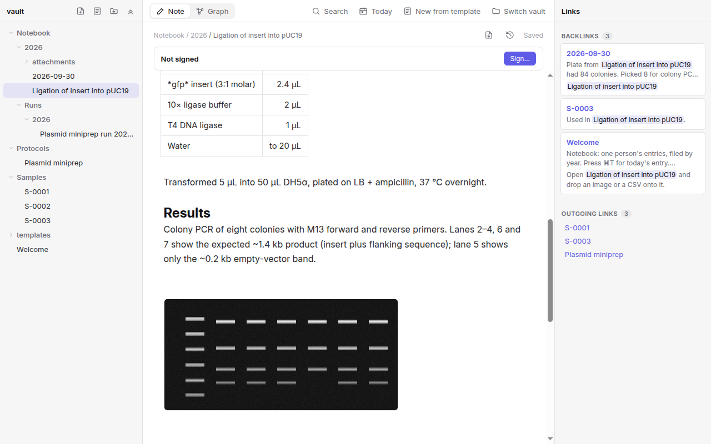

# Prem

**An open-source lab notebook that runs on your own machines.**

Prem is a desktop app for research labs. Each person keeps a daily notebook; the lab shares protocols; running a protocol records every step with a timestamp; samples, experiments and runs link to each other; and finished records are signed, witnessed and locked. Everything is a plain markdown file in a folder you own, with every version kept and a tamper-evident history, so your records stay readable for decades and never depend on a vendor.

Prem is in active development towards a first release. It is being piloted with research labs now; see the [roadmap](#roadmap).

**Website:** [cameronjtoy.github.io/Prem](https://cameronjtoy.github.io/Prem/)



## Why Prem

- **Your data stays with the lab.** Notebooks are folders of markdown and attachments on your computer or on a server you run. No account with us, no cloud, no telemetry.
- **Built for the bench.** Protocols with checkable steps, runs that record when each step was done and what deviated, samples with IDs and storage locations, and attachments for gels, plates and traces.
- **Records you can stand behind.** Every save is kept. Signing locks an entry; a colleague witnesses it; later changes are amendments with a reason. Any tampering with the history is detectable.
- **Works for one person or a whole lab.** Start with a local folder. Add the team server when you want shared protocols, per-person notebooks and permissions (students write their own notebook, the PI reads everything).
- **Open source** under Apache-2.0, with a codebase meant to be read and extended.

## Getting started

Download Prem for macOS, Windows or Linux from the [latest release](https://github.com/cameronjtoy/Prem/releases/latest). The installers aren't signed yet, so macOS and Windows warn the first time you open Prem; the [install guide](docs/install.md) shows how to get past that.

To run from source instead:

```bash
git clone https://github.com/cameronjtoy/Prem.git
cd Prem
npm install
npm run dev
```

Choose **Open a folder as a vault** and pick [`examples/sample-vault/`](examples/sample-vault) to explore a small lab notebook with a protocol, a completed run, an experiment with a gel image, and samples. Start with its `Welcome` note.

### Keyboard shortcuts

| Shortcut | Action |
| --- | --- |
| ⌘T | Today's notebook entry |
| ⌘K | Search all notes |
| ⌘N / ⌘⇧N | New note / new note from template |
| ⌘G | Graph of how notes link |
| ⌘S | Save now (notes also autosave) |
| ⌘P | Export the open note as a PDF |
| ⌘O | Open another vault |

## Features

**Notebook**
- **Daily entries** (⌘T) filed by year: `Notebook/2026/2026-09-30.md`, or `Notebooks/<name>/…` on a shared vault so each person's notebook can have its own permissions.
- **Templates** for Experiment, Protocol, Sample, Lab meeting, Reference and Daily entry, with `{{title}}`, `{{date}}`, `{{time}}`, `{{author}}` and `{{cursor}}` placeholders. Add your own to the vault's `templates/` folder.
- **Live-preview editor** (CodeMirror): markdown syntax hides except on the line you're editing. Equations with KaTeX, tables, checkboxes, syntax-highlighted code.
- **Links** between notes with `[[Note]]`, autocomplete, backlinks and a graph view. A link to a note that doesn't exist yet creates it on click.
- **Attachments**: drop files or paste screenshots into an entry. Images and CSV/TSV preview inline; other files open in their default app (only known data formats are opened directly, so a stray script can't run by accident). Up to 100 MB per file.
- **Search** (⌘K) across titles, folders and text, with quoted phrases; results open at the match.

**Protocols and runs**
- A `type: protocol` note gets a **Start run** button. A run copies the protocol's materials and steps into a new note in your notebook, records who ran it and when, **timestamps each step as you tick it**, logs **deviations**, and marks when it was completed.
- Protocols list their runs under Backlinks, so you can see every time a method was used.

**Records you can trust**
- **History**: every save of every note is kept, including edits made in other apps, with who and when. View what changed, restore any version (as a normal, undoable edit).
- **Signing**: sign an experiment, run or entry to lock it; a colleague can **witness** it; change it only through an **amendment** with a reason. The history is a hash chain, so altering a past version or signature is detected. Prem flags signed notes changed outside the app, even while it was closed.
- **PDF export** (⌘P, or right-click a note or folder): the entry with its metadata, embedded images, every signature, witness and amendment, whether the history checks out, and a hash of the printed content. A folder exports as one PDF, one entry per page, for archiving a notebook.
- Signatures record identity from your team-server login (or your computer's user locally). They are tamper-evident attestations, not cryptographic signatures yet, and Prem is not certified for 21 CFR Part 11.

**Lab server**
- Hosts one vault for the whole lab: a token per person, per-folder `none` / `read` / `write` permissions, live updates, and conflict protection when two people edit the same note.
- A single Node file with no database. The vault stays a folder you can back up or keep in git.
- See [docs/runbooks](docs/runbooks/Deploying%20Prem.md) for deploying, adding people, backups and troubleshooting, and [docs/examples](docs/examples/prem-server.example.json) for the config format.

Each release includes the server as a Docker image (`ghcr.io/cameronjtoy/prem-server`) and as a single JavaScript file for Node.js; see [the install guide](docs/install.md#the-lab-server). From source:

```bash
npm run server:token -- alice      # create a token for a person or bot
npm run server                     # build and start the server (reads prem-server.json)
```

## Roadmap

**v0.1 (pilot)**: installers for macOS, Windows and Linux; PDF export with signatures; a guided lab-server setup; notebook (`.ipynb`) preview.

**v0.2 (public launch)**: signed installers and auto-update; **lab workflows** (a sample or project moving through stages with tasks and a board); a `prem` Python package so Jupyter analyses write figures and results back into entries.

**v0.3**: analysis cells inside entries with a Prem-managed Python kernel; sample registry with IDs and inventory; comments; an admin screen for people and permissions.

## For developers

```bash
npm run dev            # run the app with hot reload
npm test               # unit tests
npm run lint           # oxlint
npm run format         # prettier
npm run typecheck      # main, preload, renderer and server
npm run build          # production bundles into out/
npm run server:build   # the team server as a single file, out/server/index.js
npm run package        # installers for this computer, into dist/ (see electron-builder.yml)
npm run package:dir    # an unpacked app in dist/, quicker for testing packaging
npm run site           # the website (site/ and docs/) into _site/, with a link check
```

Read [docs/ARCHITECTURE.md](docs/ARCHITECTURE.md) for how the pieces fit: the storage seam that lets every feature work on a local folder and on the team server alike, how history and signing are stored, and where logic belongs. [CONTRIBUTING.md](CONTRIBUTING.md) covers setup and how changes are made; [SECURITY.md](SECURITY.md) explains how to report a vulnerability privately, and everyone taking part follows the [Code of Conduct](CODE_OF_CONDUCT.md). Notable changes are listed in [CHANGELOG.md](CHANGELOG.md).

### Troubleshooting
If `npm run dev` fails with `Cannot read properties of undefined (reading 'whenReady')`, your shell has `ELECTRON_RUN_AS_NODE` set (some editors' terminals do this). Run `unset ELECTRON_RUN_AS_NODE` and try again.

## License

Prem is open source under the [Apache License 2.0](LICENSE).
