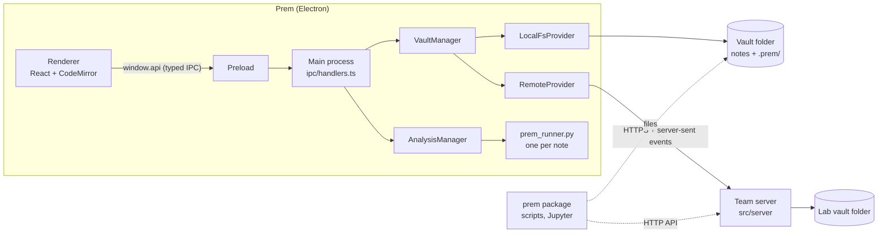

# Architecture

Prem is an Electron desktop app plus an optional team server. A **vault** is a folder of markdown notes and attachments; everything Prem adds lives in a hidden `.prem` folder inside it, so a vault is always just files you can back up, keep in git or open in another editor.

This page is for people changing Prem's code. [`DESIGN_SYSTEM.md`](DESIGN_SYSTEM.md) covers how the interface looks, and [`SECURITY.md`](../SECURITY.md) how to report a vulnerability.

## Overview



The renderer never touches files, the network or Python. It asks main, through a narrow typed API, and main checks every argument again before acting.

## Layers

```
src/
  shared/      Plain TypeScript with no Electron, Node-only or React code, used by every process
    vault/       paths, per-folder access rules, error codes, IPC and HTTP contracts, core types
    notes/       templates, the daily notebook, frontmatter, wikilinks, tables, link index and resolution
    records/     history entries, signing status, protocol runs, workflows and jobs, line diff
    search/      the in-memory full-text index
    attachments/ attachment naming and links, CSV parsing, notebook (.ipynb) previews
    analysis/    analysis cells and their outputs, environment lists, reproducing, what needs approval
    settings/    the settings schema and validation
    commands.ts, keybindings.ts   every command, its default shortcut, and keybindings.json
    diagnostics.ts, updates.ts    problem reports, and when auto-update may run
  main/        Electron main process
    index.ts     window and app lifecycle, wiring
    ipc/         validates renderer requests and routes them to the vault layer
    vault/       VaultProvider, LocalFsProvider, RemoteProvider, NoteHistory, VaultManager, backup, format
    analysis/    finding Python, per-vault environments, the cell runner, approvals (trust.ts)
    export/      PDF export
    menu.ts, settings.ts, keybindings.ts, state.ts, log.ts, updates.ts
  preload/     exposes a narrow, typed `window.api` to the renderer through contextBridge
  renderer/    React UI: file tree, CodeMirror editor and extensions, board, panels, dialogs
  server/      the team server: config and tokens, HTTP API, change stream, access checks, lab admin CLI
python/        the prem-notebook package, for writing to a vault from Python (its own pytest suite)
e2e/           Playwright tests that drive the built app
```

The rule that keeps this maintainable: **logic goes in `shared/` as pure functions with tests**; `main/` and `server/` wire it to storage; `renderer/` only calls `window.api`. If you find yourself writing business logic in a React component or an IPC handler, it probably belongs in `shared/`.

### Where new code goes

- **Parses or changes note text, or decides a rule** (who may do what, what a record's status is): `shared/`, with a test next to it.
- **Touches the disk, a child process, the OS or Electron:** `main/`, behind a method on `VaultManager` or `AnalysisManager`.
- **Only the team server needs it:** `server/`.
- **Draws something or handles input:** `renderer/`, calling `vaultClient` and registering commands with `useCommand`. Follow [`DESIGN_SYSTEM.md`](DESIGN_SYSTEM.md).
- **A new IPC call:** the channel and its type in [`shared/vault/ipc.ts`](../src/shared/vault/ipc.ts), the handler (validating every argument) in [`main/ipc/handlers.ts`](../src/main/ipc/handlers.ts), the bridge in [`preload/index.ts`](../src/preload/index.ts), and the wrapper in [`vaultClient.ts`](../src/renderer/src/services/vaultClient.ts).

## Data on disk

| Where | What | Written by | Safe to delete? |
|---|---|---|---|
| vault: notes, `attachments/` | the notebook | the app, other editors, the `prem` package | no: they are the notebook |
| vault: `.prem/history/<note>.jsonl` | each note's hash-chained history log | `NoteHistory` only | no: history and signatures are lost |
| vault: `.prem/objects/` | every saved version, compressed, by hash | `NoteHistory` only | no |
| vault: `.prem/format.json` | the vault format version | `checkVaultFormat`, on first open | yes: it is written again |
| vault: `.trash/` | deleted files on the team server (the app uses the system trash) | the server | yes, once nothing in it is needed |
| userData: `settings.json`, `keybindings.json` | the person's settings and shortcuts | the person, or the Settings screen | yes: defaults return |
| userData: `state.json` | the last vault or server opened | `main/state.ts` | yes |
| userData: `analysis-trust.json` | code and environment lists this computer approved | `TrustStore` | yes: Prem asks again |
| userData: `envs/`, `runner/` | Python environments and the runner script | `AnalysisManager` | yes: rebuilt when needed |
| userData: `logs/` | `main.log`, rotated at 1 MB, three older files kept | `LogFile` | yes |

userData is `~/Library/Application Support/Prem` on macOS, `%APPDATA%\Prem` on Windows and `~/.config/Prem` on Linux.

## The storage seam

[`VaultProvider`](../src/main/vault/VaultProvider.ts) is the one interface everything above storage uses. Paths are vault-relative POSIX strings. Two implementations:

- [`LocalFsProvider`](../src/main/vault/LocalFsProvider.ts) reads and writes a folder on disk. It is the only code that touches the vault's files. Every path is normalised and checked so it cannot escape the vault, including through symlinks ([`safePath.ts`](../src/main/vault/safePath.ts)); hidden paths (`.prem`, `.trash`, `.git`) are refused. Writes are atomic (temp file + rename). A chokidar watcher reports outside changes.
- [`RemoteProvider`](../src/main/vault/RemoteProvider.ts) implements the same interface over HTTP against the team server, and follows its server-sent event stream for live updates, reconnecting with backoff and resyncing what it missed. It refuses plain `http://` except to this computer.

[`VaultManager`](../src/main/vault/VaultManager.ts) owns the open provider plus the link index and search index, and exposes higher-level operations (open daily entry, create from template, attach a file, sign, history, back up). On open it checks the vault's format ([`format.ts`](../src/main/vault/format.ts)): a vault written by a newer Prem, with a higher `VAULT_FORMAT`, is refused with a message rather than half understood. The team server makes the same check when it starts.

Because the renderer never knows which provider is in use, every feature works identically on a local folder and on a team vault.

## Versioning and conflicts

Every read returns a `version` (derived from mtime and size); every write may carry `expectedVersion`. If the file changed in between, the write fails with `CONFLICT` and the editor shows "keep mine / reload". The team server serialises writes to the same note under a per-path lock so version checks cannot interleave.

## History and signing

[`NoteHistory`](../src/main/vault/NoteHistory.ts) records every version of every note in `.prem/`:

- `.prem/history/<note>.jsonl` is an append-only log. Each entry's `id` is a SHA-256 over its fields plus the previous entry's `id`, so the log is a hash chain: altering, removing or reordering a past entry breaks every id after it (`verify()`).
- `.prem/objects/ab/<hash>.gz` holds each distinct version, compressed and shared between notes. Reads re-check the hash.

Saves, outside edits (from the watcher, or caught up before the next operation), renames, deletions, **signatures, witnesses and amendments** are all entries in this log. [`shared/records/signatures.ts`](../src/shared/records/signatures.ts) folds a log into a `RecordStatus` (draft / signed / witnessed / amended, locked or not); the provider refuses writes and deletes to locked notes unless the save carries an amendment reason.

A log that can't be read (after a sync conflict or a disk error) is never treated as empty. `NoteHistory.list` throws `HistoryUnreadable`, and `recordStatus` reports the note as locked with `chainOk: false`. The note then shows a warning and stays read-only until its log is restored from a backup.

Signatures are **attestations tied to the authenticated user** (team-server token, or the OS user locally); they are tamper-evident but not cryptographic yet.

## Records: runs, workflows and jobs

Runs, workflows and jobs are notes told apart by their `type` field, with the logic in pure functions.

- [`shared/records/runs.ts`](../src/shared/records/runs.ts) copies a protocol's materials and steps into a run and timestamps ticked steps.
- [`shared/records/workflows.ts`](../src/shared/records/workflows.ts) reads a workflow's Stages table, creates a job with a copy of it, logs the run started for each stage and moves the job on (`completeStage`). `redoStage` moves a job back without touching its log, and `rerunJob` copies a job's own stages and samples into a new job, so a rerun repeats what was done even if the workflow changed since.
- Frontmatter stays flat `key: value`, so anything with rows (stages, the stage log) is a markdown table, read and written by [`shared/notes/tables.ts`](../src/shared/notes/tables.ts).
- The bar above the editor ([`RunBar.tsx`](../src/renderer/src/components/Editor/RunBar.tsx)) offers the next step for each type.
- The link index keeps a summary of every job and workflow (`summarizeJob`, `summarizeWorkflow`), so the board and My tasks ([`components/Board/`](../src/renderer/src/components/Board)) need no extra reads. On a team server, `jobMoveRefusal` lets only a job's assignee or a PI change its stage, assignee or status.

A new record type follows the same pattern: a `type` value, a pure module in `shared/records/` with tests, a summary in the link index if a view lists them, and a branch in the bar.

**PDF export** ([`src/main/export`](../src/main/export)) prints a note, or every note in a folder, from a self-contained HTML page: [`printable.ts`](../src/main/export/printable.ts) turns markdown, metadata, the signing events and the history check into HTML (pure, unit-tested), and [`pdf.ts`](../src/main/export/pdf.ts) embeds vault images and prints it in a hidden window with scripts off. Raw HTML in a note is printed as text and the page's content security policy blocks every network load.

## Index, search and large vaults

On open, `VaultManager` reads every note once into the [link index](../src/shared/notes/linkIndex.ts) and the [search index](../src/shared/search). After that only changed notes are read again.

The window is never sent the whole index. After each change main pushes a small `IndexSummary` (a version number plus the job and workflow summaries), and the renderer asks for the rest only when it is on screen: the Links panel calls `index:links` for the open note, and the graph calls `index:graph` (`useLinkIndex`, `useNoteLinks` and `useLinkGraph` in [`LinkIndexContext.tsx`](../src/renderer/src/state/LinkIndexContext.tsx)). `LinkIndex.snapshot()` is cached per version.

`npm run e2e:scale` checks this holds with 10,000 notes ([`scripts/bench-vault.mjs`](../scripts/bench-vault.mjs), [`e2e/scale.spec.ts`](../e2e/scale.spec.ts)): open within 8 s, search within 1 s, an outside edit shown within 3 s, and main under 900 MB. Run it when you change how notes are read, indexed or sent to the window.

## Security model

What someone else could control is note text, files in a synced or shared vault, and anything on the network. The design keeps each of those away from running code.

- **Electron:** every window runs with `contextIsolation`, `sandbox` and `webSecurity` on and `nodeIntegration` off. New windows are denied, navigating away is blocked, and external links open only for `http:`, `https:` and `mailto:`. The main window has a Content-Security-Policy, added at build time by [`electron.vite.config.ts`](../electron.vite.config.ts): scripts only from the app, and no plugins, frames, forms or `<base>`.
- **Paths:** every path from the renderer, the server API or a note is normalised and checked against the vault root, symlinks included ([`shared/vault/paths.ts`](../src/shared/vault/paths.ts), [`safePath.ts`](../src/main/vault/safePath.ts)).
- **HTML in notes:** Jupyter outputs and rendered markdown go through DOMPurify; nothing in a note runs.
- **Running code:** nothing runs by itself. Main refuses to run a cell, or install an environment list, that this computer hasn't approved, with `NEEDS_APPROVAL` ([`main/analysis/trust.ts`](../src/main/analysis/trust.ts)). Approvals are SHA-256 hashes of the code or of the package lines, kept per vault in `analysis-trust.json` in userData. That is outside the vault on purpose, so nothing in a synced folder can add to them. Code typed in this session counts as approved; code that arrived any other way (sync, a teammate, another app) shows [`ApproveRun.tsx`](../src/renderer/src/components/Editor/ApproveRun.tsx) first. Signed notes can't be run.
- **Team server:** one random 256-bit token per person, stored only as a SHA-256 and compared in constant time. Permissions per folder, and attribution from the token, never the request. Bodies are capped at 20 MB, repeated failed sign-ins from one address get `429`, and the server listens on `127.0.0.1` unless told otherwise. The app and the Python package refuse plain `http://` to another machine.
- **Diagnostics:** nothing is sent automatically. A problem report is shown in full first, with the vault's location, the home folder and tokens removed (`redact` in [`shared/diagnostics.ts`](../src/shared/diagnostics.ts)).

Not covered yet: signatures are attestations rather than cryptographic signatures, and installers are unsigned until the certificates are added (see [Releases](#releases)).

## Commands and shortcuts

[`shared/commands.ts`](../src/shared/commands.ts) lists every command with its default shortcut, written once with `Mod` (⌘ on macOS, Ctrl elsewhere) and matched on the physical key. The keyboard dispatcher, the application menu ([`main/menu.ts`](../src/main/menu.ts)), the command palette, the shortcuts sheet and the README table all read it; a test fails if the README drifts. Components register what a command does while they're on screen with `useCommand(id, run, enabled)` ([`renderer/src/commands/registry.ts`](../src/renderer/src/commands/registry.ts)): the shell handles navigation, the open note handles formatting and signing. A command that can't run right now leaves its key to the editor, so ⌘[ still indents when there's nothing to go back to.

People's own shortcuts are in `keybindings.json`. [`shared/keybindings.ts`](../src/shared/keybindings.ts) validates it, applies its entries on top of the defaults (`resolveBindings`) and edits it so it lists only changes (`withBinding`). Main watches it the same way as `settings.json` (both are a [`WatchedJsonFile`](../src/main/jsonFile.ts)) and rebuilds the menu when it changes; the renderer passes the result to `setBindings`. A key bound to two commands runs whichever can run at the time (`commandsForKey`).

## Settings

[`shared/settings/schema.ts`](../src/shared/settings/schema.ts) lists every setting with its type, default and allowed values; the Settings screen is built from it and `settings.json` is checked against it. `validate` keeps every good value and reports each bad one, falling back to its default, and `withSetting` writes only what differs from the default while keeping entries Prem doesn't know. [`main/settings.ts`](../src/main/settings.ts) watches the file's folder (so editors that save by replacing the file are seen), and keeps the last good settings while the file has a syntax error. Main applies the theme through `nativeTheme`, so the renderer's `prefers-color-scheme` styles follow it, and sends every change to the renderer, which sets CSS variables ([`SettingsContext.tsx`](../src/renderer/src/state/SettingsContext.tsx)) and reconfigures the editor in place. What Prem remembers between launches (the last vault or server) is in [`main/state.ts`](../src/main/state.ts) and `state.json`, out of the way of people's settings.

## Python analysis

[`main/analysis`](../src/main/analysis) runs Python for notes; [`docs/analysis.md`](analysis.md) describes it from the outside.
- [`python.ts`](../src/main/analysis/python.ts) finds Python (a setting, uv, then `python3`).
- [`environment.ts`](../src/main/analysis/environment.ts) builds one environment per vault from `environment.txt` under `<userData>/envs/<vault id>` and stamps it with `pip freeze`.
- [`prem_runner.py`](../src/main/analysis/prem_runner.py) is a stdlib-only script that runs a note's cells over JSON lines on stdin/stdout. It keeps a namespace per process, displays the last expression, captures figures and tables, and records files read via an audit hook. It is bundled into main with `?raw` and written to `<userData>/runner` at startup.
- [`runner.ts`](../src/main/analysis/runner.ts) manages one process: queueing, timeouts and SIGINT for Stop.
- [`shared/analysis/cells.ts`](../src/shared/analysis/cells.ts) finds `python {run}` cells and reads and writes their `prem:output` blocks, as pure functions. In the editor, [`analysisCells.ts`](../src/renderer/src/components/Editor/extensions/analysisCells.ts) draws each cell's toolbar and output from a StateField, and [`cellRunner.ts`](../src/renderer/src/components/Editor/cellRunner.ts) runs a cell, stores its figures and tables with `addAttachment`, and writes the output as an ordinary edit. That edit is autosaved, so history and signing cover it.
- [`shared/analysis/reproduce.ts`](../src/shared/analysis/reproduce.ts) formats and reads the saved environment lists (`attachments/environment-<id>.txt`), finds outputs whose inputs changed, and compares a rerun with a recorded output part by part. `AnalysisManager.reproduce` rebuilds a recorded environment under `<userData>/envs/locked/<id>` and reruns cells in a throwaway runner, writing nothing.
- [`AnalysisManager.ts`](../src/main/analysis/AnalysisManager.ts) keeps one runner per note. It refuses locked notes and anything not yet approved (see [Security model](#security-model)), and on team vaults copies a note's attachments to a scratch folder so code never talks to the server.

[`python/`](../python) is the `prem-notebook` package ([`docs/python.md`](python.md)). It has no dependencies and two backends:
- **Team server:** it talks to the server's HTTP API, so permissions, attribution and the signed-note lock are the server's own.
- **Local vault:** it writes files atomically and leaves history to the app, which records the change as an outside edit. It never writes `.prem`, because `NoteHistory` caches each log's last entry, and a second writer would break the chain. It reads the history log only to refuse signed notes, folding entries the way `applyEntry` does.

[`_markdown.py`](../python/src/prem/_markdown.py) ports the few note rules it needs: frontmatter, sections, tables, attachment names and links. Change the TypeScript and Python versions together. `e2e/python.spec.ts` checks that a write from Python reaches the open editor and shows as an outside change.

## Renames and links

[`shared/notes/relink.ts`](../src/shared/notes/relink.ts) is a pure function from a note's text to its text after a move: it resolves each wikilink against the vault as it was before (the same resolver the editor uses) and rewrites the ones that pointed at something that moved, and recomputes relative markdown links. `VaultManager.rename` runs it over every note after the provider moves the files, writing with the version it read so a concurrent edit isn't overwritten. Locked and read-only notes are reported, not changed, so a rename never alters a signed record or bypasses permissions. On a team vault this happens in the renaming person's app, through the same permission checks as any other save.

## Team server

[`src/server`](../src/server) wraps a `LocalFsProvider` in a small Node HTTP server (no framework, no database):

- **Auth**: one bearer token per person or bot; only SHA-256 hashes are stored in the config.
- **Permissions**: per-folder `none` / `read` / `write` rules ([`shared/vault/access.ts`](../src/shared/vault/access.ts)); the deepest matching rule wins; unmatched paths are invisible. Listings, reads, search results and live events are all filtered by them. A person's `role` (such as `pi`) comes from the config and is passed to the app.
- **Attribution**: the author of every save, signature and witness comes from the token, never from the request body.
- **Change stream**: `GET /api/events` is server-sent events, filtered per user; a client's own saves are not echoed back to it.
- **Administration**: [`cli.ts`](../src/server/cli.ts) is the command line (`init`, `add`, `remove`, `token`, `list`, and serving). [`lab.ts`](../src/server/lab.ts) holds the roles and the permissions each gets, and edits the config as plain JSON so unknown fields survive. The running server watches its config and calls `updateUsers`, which swaps the people in place and closes the live stream of anyone whose token or permissions changed, so their app reconnects under the new rules.

The server bundles to a single file (`out/server/index.js`) with only Node built-ins, so deploying it is copying one file. Backing up a team vault is the server's job: see [Backups](lab-server.md#backups).

## Diagnostics and backup

- **Log:** [`LogFile`](../src/main/log.ts) appends to `<userData>/logs/main.log`, rotating at 1 MB and keeping three older files. `captureConsole` sends main's warnings, errors and crashes to it, and errors in the window arrive over `app:logError`. Writing a log line never throws.
- **Report a problem:** `app:diagnostics` gathers the version, the system, the vault kind and the last 200 log lines, redacted. [`ReportProblem.tsx`](../src/renderer/src/components/ReportProblem.tsx) shows all of it and opens a prefilled GitHub issue; `issueUrl` keeps the body under 6,000 characters by shortening the log from the top.
- **Backup:** [`backup.ts`](../src/main/vault/backup.ts) writes a standard zip of the whole local vault, `.prem` included, one file at a time and with no dependencies. It stays within the classic zip limits (4 GB, 65,535 files) and says to copy the folder for anything bigger. A failed backup removes its partial file.

## Releases

- [`release.yml`](../.github/workflows/release.yml) runs on a `v*` tag, builds every platform and the server, and opens a draft release.
- [`electron-builder.config.cjs`](../electron-builder.config.cjs) signs and notarizes only when the certificate secrets are present (`CSC_LINK`, the `APPLE_*` secrets, `WIN_CSC_LINK`); otherwise it builds unsigned. CONTRIBUTING lists the secrets.
- **Auto-update:** [`shared/updates.ts`](../src/shared/updates.ts) decides whether it may run (`canAutoUpdate`: a packaged build that's signed, or the Linux AppImage, with the setting on). `PREM_SIGNED_BUILD` is set at build time from the same secrets, so an unsigned build never tries to update itself. [`main/updates.ts`](../src/main/updates.ts) uses `electron-updater` against GitHub Releases and tells the window when a version is ready, which shows a "Restart to update" banner.
- [`python-release.yml`](../.github/workflows/python-release.yml) publishes the Python package to PyPI on a `py-v*` release, with trusted publishing and no stored token.

## Renderer

- The editor is CodeMirror 6 with a live-preview extension that hides markdown syntax except on the active line, and widgets for wikilinks, checkboxes, tables, math (KaTeX), attachments and analysis cells.
- State lives in a few contexts: `VaultContext` (what's open, permissions, your role), `LinkIndexContext` (the index summary, and links and graph on demand), `WorkspaceContext` (open note, views, actions) and `SettingsContext` (settings as CSS variables and editor options).
- Views: Note, Graph and Board, plus dialogs (search, palette, history, approvals, report a problem).
- How it should look and behave is in [`DESIGN_SYSTEM.md`](DESIGN_SYSTEM.md).

## Testing and CI

- **Unit tests** (Vitest) sit next to the code they test, as `*.test.ts` under `src/`. Server tests start a real server on a random port and exercise it through `RemoteProvider`. The Python runner's tests drive it with the real `python3`.
- **End-to-end tests** (Playwright driving the built Electron app) are in [`e2e/`](../e2e). Each test gets a fresh copy of the sample vault and its own userData; `team.spec.ts` runs the real server with two people. Tests tagged `@smoke` also run on macOS and Windows; the `@slow` scale test runs only with `npm run e2e:scale`.
- **Python:** `pytest python/tests`, including tests against a real server.
- **Docs:** [`links.test.ts`](../src/docs/links.test.ts) checks that every relative link in the docs points at a file that exists, and [`tokens.test.ts`](../src/docs/tokens.test.ts) that every colour token is defined in both themes, documented in the design system, and readable.

[`ci.yml`](../.github/workflows/ci.yml) runs on every pull request:

| Job | Runs on | What |
|---|---|---|
| Typecheck, test and build | Linux | format, lint, typecheck, unit tests, both builds, third-party notices, the site |
| Unit and smoke tests | macOS, Windows | typecheck, unit tests, both builds, the `@smoke` e2e tests |
| Large vault | Linux | `npm run e2e:scale` |
| Python package | Linux, Python 3.9 and 3.13 | pytest, then building and installing the wheel |
| End-to-end tests | Linux | the whole e2e suite |

CodeQL scans every pull request and runs weekly, and Dependabot keeps dependencies current.
